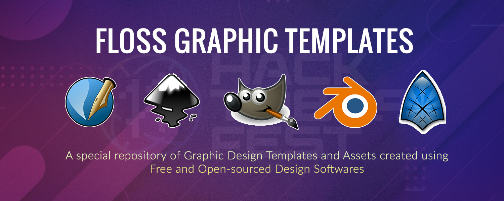

# 
 FLOSS Graphics Templates 

A repository that contains different basic design templates for open-source graphics softwares like **GIMP, Scribus, Inkscape, Synfig and Blender**. All contributions are welcome, but please ensure that all raw files are in the native format of the above softwares only.

<!-- CONTRIBUTING -->

## 📌 Contributing

Contributions are what make the open source community such an amazing place to learn, inspire, and create. Any contributions you make are **greatly appreciated**. For a detailed tutorial on how to contribute, refer to `CONTRIBUTING.md` file.

1. Fork [this](https://github.com/anubhab1710/FLOSS-Graphics-Templates/) Project 
2. Clone your forked copy to your system (`git clone project_url`)
3. Navigate to your project Directory (`cd repo_name`)
4. Create your Feature Branch ( `git checkout -b branchname` )
5. Make the desired changes and add your features
6. Add your Changed files ( `git add .` )
7. Commit your Changes ( `git commit -m 'Add some AmazingFeature'` )
8. Push to the Branch ( `git push origin branchname` )
9. Open a Pull Request

 ### 
All contributions are welcome!

 ### 
❤ Let us uphold the spirit of Open-Source and make our ideas stand-out! ❤

